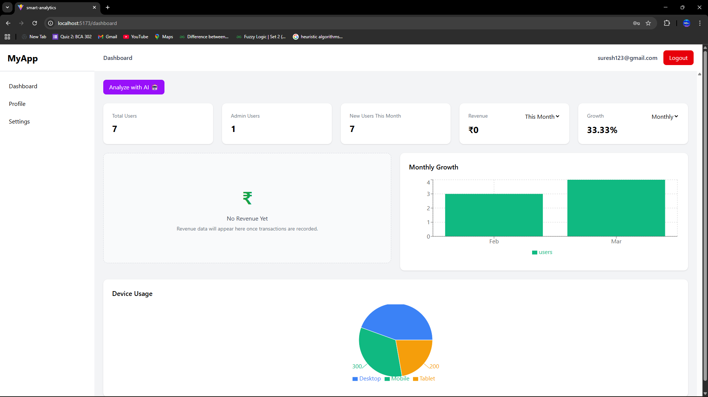
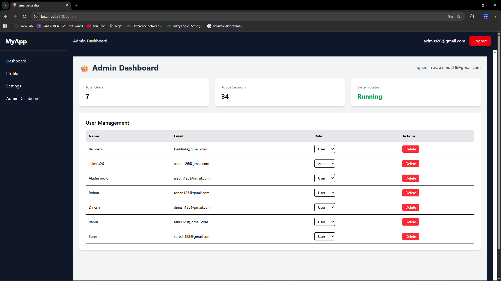
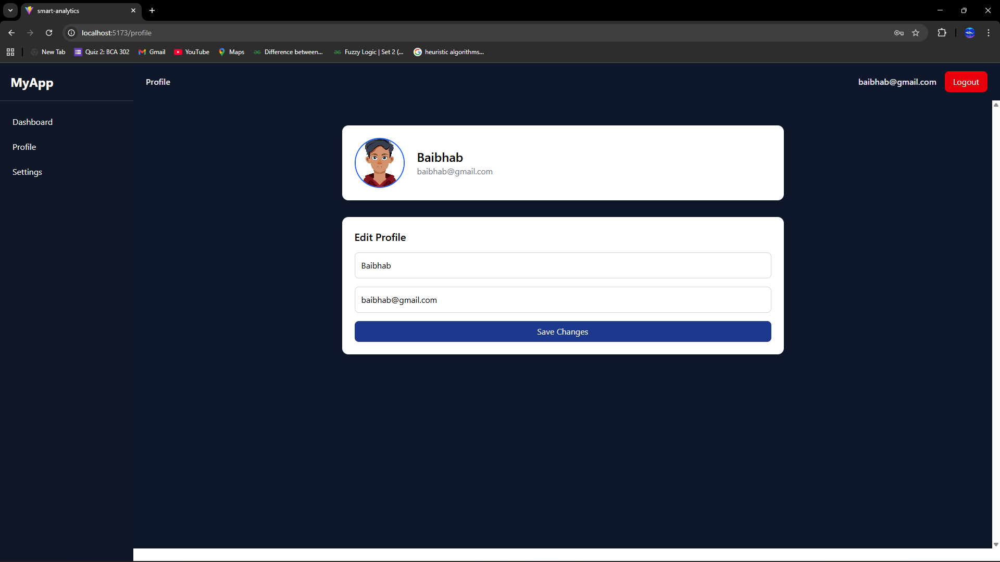
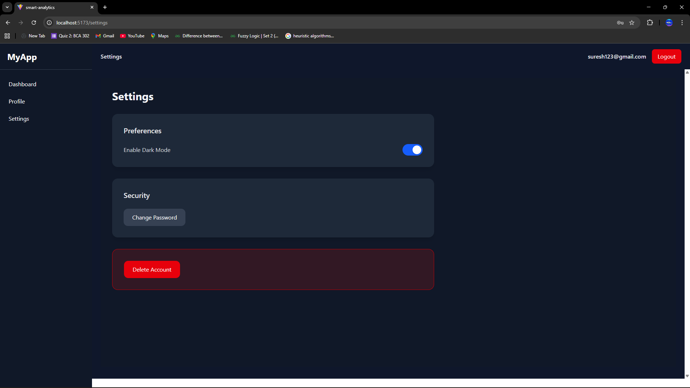

# 📊 Smart Analytics Dashboard

A full-stack **AI-powered analytics dashboard** with admin panel, user management, and real-time data visualization.

---

## 🌐 Live Demo

🚧 Not deployed yet

---

## ✨ Features

* 🔐 Secure Authentication (JWT-based)
* 👤 User Profile Management
* ⚙️ Admin Dashboard (role-based access)
* 👥 User Management (update roles, delete users)
* 📊 Real-time analytics dashboard
* 📈 Growth & usage charts (Recharts)
* 🤖 AI-powered insights (integration ready)
* 🌙 Clean modern UI (Tailwind CSS)

---

## 🛠️ Tech Stack

### 🎨 Frontend

* React.js (Vite)
* Tailwind CSS
* Recharts

### ⚙️ Backend

* Node.js
* Express.js

### 🗄️ Database

* MongoDB

### 🔐 Authentication

* JWT (JSON Web Token)

---

## 📸 Screenshots

### 🔐 Login Page


### 📊 Dashboard


### 👑 Admin Panel


### 👤 Profile Page


### ⚙️ Settings Page

---

## 📁 Project Structure

```bash
smart-analytics-dashboard/
│
├── Client/        # React frontend
├── Server/        # Express backend
│   ├── routes/
│   ├── controllers/
│   ├── models/
│   ├── middleware/
│
└── README.md
```

---

## ⚙️ Installation & Setup

### 1️⃣ Clone Repository

```bash
git clone https://github.com/Baibhab-Bagchi/smart-analytics-dashboard.git
cd smart-analytics-dashboard
```

---

### 2️⃣ Setup Backend

```bash
cd Server
npm install
```

Create `.env` file:

```
MONGO_URI=your_mongodb_connection_string
JWT_SECRET=your_secret_key
CLIENT_URL=http://localhost:5173
```

Run backend:

```bash
npm run dev
```

---

### 3️⃣ Setup Frontend

```bash
cd Client
npm install
npm run dev
```

---

## ✨ Features

- 🔐 Secure Authentication (JWT-based)
- 👤 User Profile Management
- ⚙️ Settings Page for account actions
- 👑 Admin Dashboard with role-based access
- 👥 User Management (update roles, delete users)
- 📊 Analytics dashboard with charts
- 📈 Growth, revenue, and device usage visualization
- 🤖 AI-powered insights integration
- 🌙 Clean responsive UI

---

## 👨‍💻 Author

**Baibhab Bagchi**

* 💼 Full Stack Developer (Fresher)
* 🔗 GitHub: https://github.com/Baibhab-Bagchi

---

## ⭐ Show Your Support

If you like this project, give it a ⭐ on GitHub!
